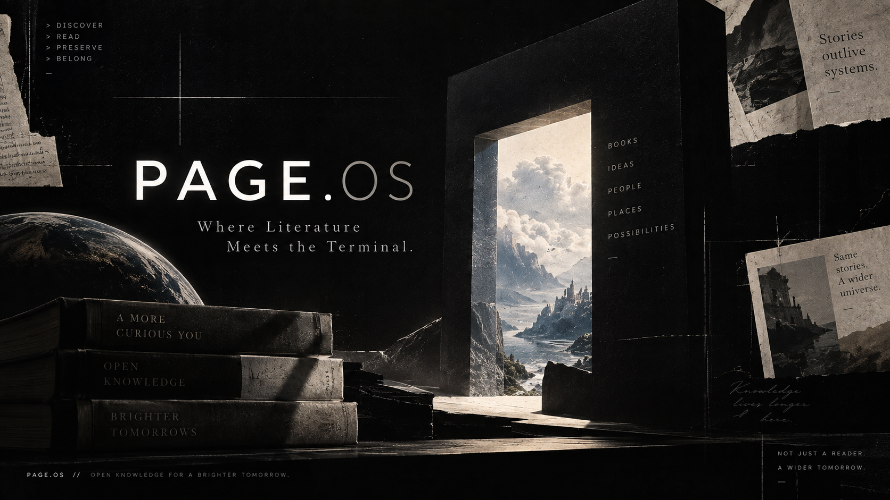
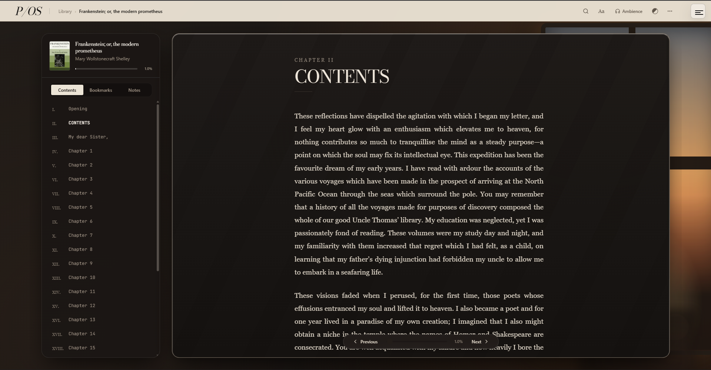
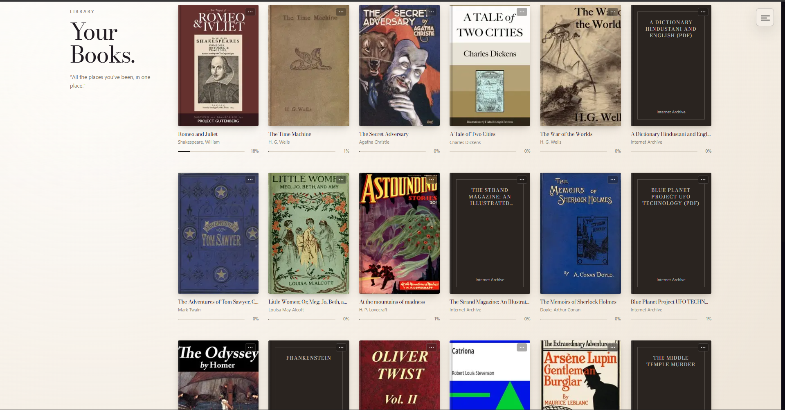
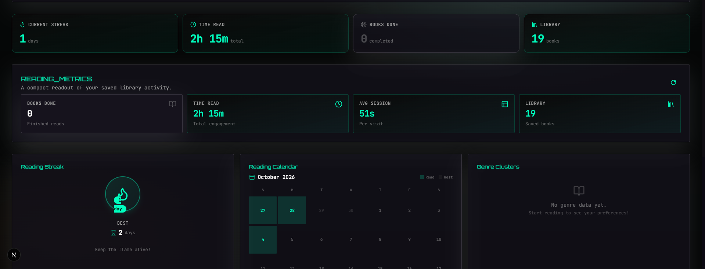

# P/OS

<p align="center"></p>

<h3 align="center">A living room for books, art, and open knowledge.</h3>

<p align="center"><em>PAGE.OS is no longer trying to look like a computer.<br>It is trying to make the internet feel like somewhere you would actually want to stay.</em></p>

<p align="center"><a href="https://pageos.vercel.app">Live</a> · <a href="https://github.com/Wafion/PAGE.OS">Source</a> · <a href="LICENSE">MIT</a></p>

---

## ✦ What is PAGE.OS?

The web is full of extraordinary things that have already been made free: books that survived centuries, paintings that outlived their owners, scans tucked away in archives, photographs nobody remembers taking, and ideas that somehow kept travelling.

PAGE.OS is a way of wandering through that material without making it feel like you are filling out a database form.

It brings together **public-domain books, open archive material, and public-domain / open-access artwork** into one deliberately designed reading and discovery environment.

Three ideas sit underneath the whole thing:

**Read.** Long-form books with chapters, progress, bookmarks, notes, and reader controls.

**Wander.** An infinite spatial field of artwork where dragging, zooming and drifting become part of discovery.

**Keep.** A personal library and reading memory that lets the things you find stick around.

> PAGE.OS is not a search engine wearing a pretty coat.
>
> It is an **interface for curiosity**.

---

# The experience

## 01 · The front door

<p align="center"></p>

The landing experience sits somewhere between a reading room and a record sleeve left on a mountain.

The current motion-led presentation combines a large editorial statement, a visual hero, ambient sound, and a tactile entry point into the archive. The interface is intentionally quiet before the catalogue starts moving.

PAGE.OS supports a Motion presentation alongside the project's other interface modes, with shared route navigation and layout handled at the application level.

The classic interface can also use a small boot experience, while Lounge and Motion skip unnecessary startup ceremony.

---

## 02 · Recommendations that drift

<p align="center"></p>

Books do not sit there waiting for you like obedient database rows.

The recommendation shelf drifts.

It automatically glides across the viewport, pauses on hover, and can be dragged by hand. The shelf duplicates its card sequence to create a seamless loop, while books receive subtle 3D tilt, page-edge treatment, hover lift, and an explicit reading action.

The implementation also caches recommendation shelves locally and can pre-warm other genre shelves when the browser is idle. Fallback shelves are available when a remote recommendation source is unavailable.

Current recommendation categories include Popular, Science fiction, Mystery, Romance, and Adventure.

The result is less "catalogue grid" and more "someone left a really good shelf unattended."

---

## 03 · A book before you commit

<p align="center"></p>

A book can open into a focused briefing before you start reading.

The preview surface can expose source, cover, title, author, synopsis, reading action, save, and share interactions.

It creates a useful pause between **"that looks interesting"** and **"well, I guess I'm reading this for six hours."**

---

## 04 · Read like you mean it

<p align="center"></p>

The reader is built around the actual act of reading rather than the ceremony around it.

PAGE.OS supports:

- chapter navigation and table of contents
- reading progress
- previous / next navigation
- bookmarks
- notes and marginalia
- reader settings
- long-form scrolling
- TXT-based reading
- dedicated PDF reading
- motion and classic reader presentations

The Motion reader turns each reading sector into a page-like composition with animated transitions, a parchment-inspired sheet, adjustable typography, and a floating progress/navigation control.

The classic reader takes a more structural approach, with a chapter map on the left and the active reading sector in the main pane.

**Same book. Different room.**

---

## 05 · The archive is bigger than books

<p align="center"></p>

This is where PAGE.OS stops behaving like a bookshelf.

**Infinite Mode** turns open artwork into a spatial canvas.

Instead of scrolling one card after another, the interface gives you a world:

- drag to pan
- pinch to zoom
- wheel to move
- keyboard movement with `WASD` or arrow keys
- inertial camera movement
- automatic wandering
- spatial chunking for large galleries
- a conventional feed view when you want it

The gallery is rendered in spatial chunks. Each chunk uses deterministic seeded placement, so the field can feel organic without requiring an enormous permanently rendered canvas.

The camera behaves like a physical object: pointer movement updates position, released drag velocity decays through inertia, and zoom can stay anchored around the interaction point.

**You are not scrolling through the archive.**

You are walking around inside it.

---

## 06 · Infinite Mode has a second language

<p align="center"></p>

Not everyone wants a spatial museum every day.

Infinite Mode also has a more conventional feed view, letting the same artwork system behave like a long-form stream.

The canvas and feed are two interfaces for the same idea:

> an archive becomes more interesting when the interface leaves room for accident.

Open a painting. Find a sculpture. Drift sideways. Find something from another century.

---

## 07 · Art gets its own room

<p align="center"></p>

Artwork is not treated like an oversized thumbnail.

Selecting a piece opens a dedicated information view with:

- title
- artist
- year
- medium
- dimensions
- location
- collection
- accession information
- credit line
- description
- attribution
- source links
- public-domain status where available

PAGE.OS routes artwork discovery through open cultural and open-access sources, including Wikimedia Commons, The Metropolitan Museum of Art, and the Cleveland Museum of Art.

The goal is not merely to show the image.

It is to keep the **context around the image**.

---

# Your library

<p align="center"></p>

Your library is where wandering becomes memory.

Saved books can retain reading position and personal state. The Motion bookshelf gives the collection a more physical presentation than a conventional admin grid.

PAGE.OS can optionally synchronize library and reading data through Firebase authentication and Firestore-backed user data.

The library route can also hand off directly into the Motion bookshelf experience.

---

# Your reading memory

<p align="center"></p>

PAGE.OS keeps a small record of the person behind the reading session.

The statistics system can surface:

- current streak
- longest streak
- time spent reading
- books completed
- average session length
- saved library size
- reading calendar
- genre distribution

The profile also supports Google sign-in and synced reading data.

The point is not to turn reading into a productivity dashboard.

The point is to let your history quietly tell you what you actually spend time with.

---

# Sound, but no soundtrack hostage situation

PAGE.OS treats audio as part of the environment.

The repository ships with ambient music and soundscapes organized around spaces such as:

- nature
- cozy
- focus
- shared spaces

Examples include rain, fireplace, forests, ocean waves, rivers, brown noise, pink noise, cafes, libraries, and trains.

The UI exposes volume controls, mute, presets, attribution, now-playing information, and a dedicated ambience selector.

In short:

**books can have weather now.**

---

# Search that understands archives

Search is intentionally hybrid.

A query can reach the primary Gutenberg discovery path while PAGE.OS checks open archive results in parallel.

The interface can distinguish between:

- **nothing matched**
- **the primary archive is unavailable**
- **open archive results are available**
- **a curated fallback shelf is being shown**

There is also a command-style search surface for quick navigation through the application.

PAGE.OS is not intended to be a generic web crawler. Discovery is biased toward open, public-domain, and archival sources.

---

# Source philosophy

PAGE.OS is built around sources that preserve and share knowledge.

### Books

**Project Gutenberg / Gutendex**  
Primary discovery path for public-domain literature.

**Internet Archive**  
Open archive material, metadata, and direct TXT/PDF resources where available.

### Artwork

**Wikimedia Commons**  
Public-domain and freely licensed cultural media.

**The Metropolitan Museum of Art**  
Open-access collection data and artwork.

**Cleveland Museum of Art**  
Open-access artwork and collection metadata.

PAGE.OS keeps source handling and fallback behavior separate enough that one unavailable endpoint does not necessarily make the whole discovery experience collapse.

---

# Under the hood

PAGE.OS is a **Next.js 15 / React / TypeScript** application with a heavily componentized UI.

### Frontend

- Next.js 15
- React 18
- TypeScript
- Tailwind CSS
- Radix UI
- Framer Motion
- Lucide

### Data & persistence

- Firebase Authentication
- Firestore-backed user data
- localStorage recommendation caching
- session-based boot state

### Reading & documents

- PDF.js
- TXT extraction and rendering
- custom sector / chapter navigation
- progress tracking
- bookmarks and notes

### Motion & interaction

- Framer Motion route and reader transitions
- custom drag / inertia camera
- pointer + keyboard navigation
- deterministic spatial layout
- chunk-based infinite gallery rendering
- autonomous wander mode
- auto-drifting recommendation shelf

### Audio

- bundled ambient music
- bundled SFX / ambience
- custom audio providers
- attribution surfaces

---

# Architecture, in plain English

```text
src/
├─ app/
│  ├─ infinite/        ← spatial artwork world + feed
│  ├─ library/         ← saved books
│  ├─ profile/         ← identity + reading memory
│  ├─ read/            ← classic reader
│  ├─ statistics/      ← statistics route
│  ├─ settings/        ← reader + interface preferences
│  └─ page.tsx         ← discovery / home
│
├─ components/
│  ├─ audio/           ← ambience + music controls
│  ├─ home/            ← recommendation shelf
│  ├─ layout/          ← routing / navigation / shared shell
│  ├─ library/         ← Motion bookshelf
│  ├─ read/            ← Motion reader
│  ├─ statistics/      ← reading analytics UI
│  └─ ui/              ← reusable primitives
│
├─ adapters/           ← external source integrations
├─ context/            ← app-wide state providers
├─ services/           ← user/library/statistics data
└─ lib/                ← utilities, recommendations, audio, stats
```

A particularly important part of Infinite Mode is the separation of concerns:

**camera → chunks → gallery feed → wander**

The camera handles movement and inertia.  
Chunks decide what spatial region is visible.  
The gallery feed supplies media.  
Wander can move the camera when interaction stops.

That is how PAGE.OS can feel infinite without requiring an actually infinite number of rendered elements.

---

# The motion language

The motion layer is intentionally built as a collection of small physical behaviors rather than one giant animation.

| Interaction | Response |
|---|---|
| Hover recommendation shelf | Automatic drift pauses |
| Drag recommendation shelf | Manual browsing takes over |
| Stop dragging | Drift can resume |
| Hover a book | Book lifts and reveals an action |
| Drag Infinite Mode | Camera follows pointer |
| Release Infinite Mode | Momentum decays |
| Pinch / modifier-wheel | Zoom anchors around the interaction |
| Stop touching Infinite Mode | Wander can take over |
| Change reading sector | Motion reader animates between sections |
| Toggle ambience | Environment changes without leaving the page |

The project uses Framer Motion where declarative transitions are useful, and custom pointer / requestAnimationFrame systems where continuous control matters more.

---

# Why the project looks like this

PAGE.OS deliberately moved away from its earlier **sci-fi terminal reader** identity.

The terminal influence still exists in some structural details, but the current direction is broader:

**editorial typography + archive culture + motion design + spatial discovery**

The interface can be calm, dark, cinematic, warm, strange, practical, or deliberately nostalgic depending on the screen.

The common rule is simple:

> **the interface should make the material feel worth opening.**

Not every page needs to shout.

Some pages should whisper.

---

# The asset gallery

The screenshots used throughout this README live directly in the repository:

```text
Assets/
├─ Artwork info.png
├─ Book preview.png
├─ infinite mode canvas.png
├─ infinite mode Table.png
├─ Landing 1.png
├─ Landing 2.png
├─ Landing 3.png
├─ Library.png
├─ Reader.png
├─ Stats.png
└─ Thumbnail.png
```

---

# Local development

### Requirements

- Node.js
- npm
- Firebase configuration for synced account features

### Install

```bash
git clone https://github.com/Wafion/PAGE.OS.git
cd PAGE.OS
npm install
```

### Start development

```bash
npm run dev
```

### Build

```bash
npm run build
```

### Typecheck

```bash
npm run typecheck
```

The repository also contains scripts for cleaning Next.js output, development startup, typechecking, archive/audio utilities, and proxy-guard testing.

---

# Project philosophy

### 01 · Open knowledge should feel alive

An archive is not a dead spreadsheet.

### 02 · Discovery should contain some friction

A little wandering is good. Not every interaction should collapse into “search → result → done.”

### 03 · Reading is an environment

Typography, sound, pacing, controls, and motion all change how a long text feels.

### 04 · Motion should have a reason

PAGE.OS uses drifting shelves, camera inertia, animated transitions, and spatial browsing, but the interaction model stays understandable.

### 05 · The source matters

Books and artwork carry provenance. PAGE.OS tries to surface the archive or collection behind the material rather than making the content look magically ownerless.

---

# What is still growing

PAGE.OS is a living project.

Natural next directions include:

- richer recommendation systems
- deeper archive integrations
- stronger reading analytics
- more expressive motion transitions
- better artwork metadata
- more ambient soundscapes
- exportable reading data
- broader personalisation
- more connections between books, art, and context

The underlying idea stays the same:

**make the open web feel discoverable again.**

---

# Credits & licensing

PAGE.OS is released under the **MIT License**. See [LICENSE](LICENSE).

Content shown inside PAGE.OS may be supplied by external archives and collections and remains subject to the licenses, public-domain status, attribution requirements, and source policies of those providers.

For bundled ambience/audio, see [public/SFX/ATTRIBUTIONS.md](public/SFX/ATTRIBUTIONS.md).

---

<p align="center">
  <strong>PAGE.OS</strong><br>
  <sub>Read something old. Find something strange. Keep wandering.</sub>
</p>

<p align="center"><code>open knowledge · public culture · infinite discovery</code></p>
